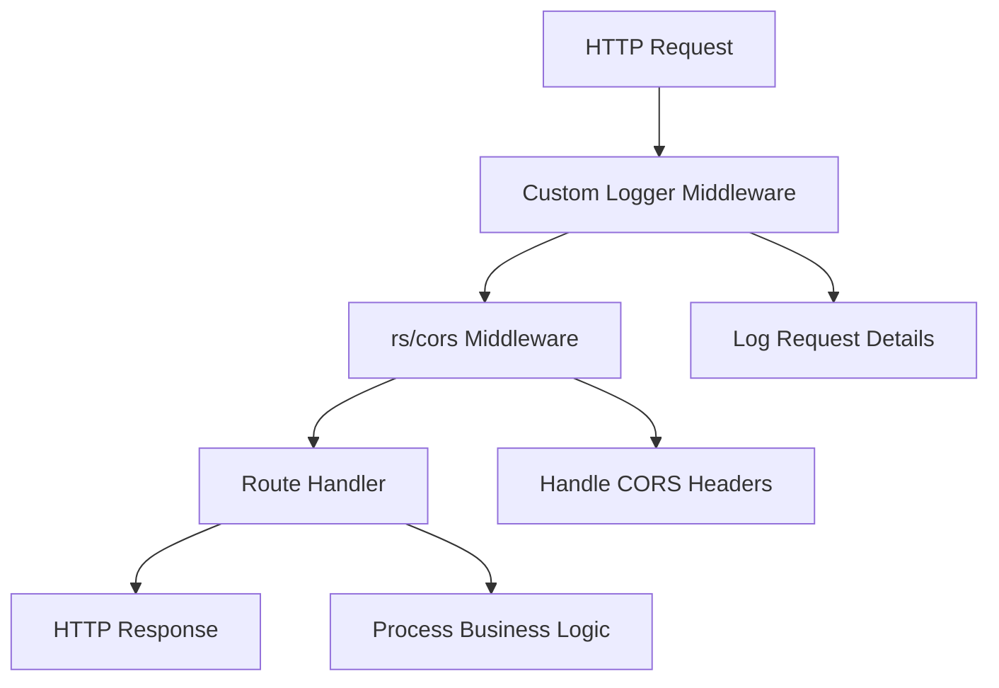

# HTTP Server Design Document

## Overview

This design implements a simple yet robust HTTP server using Go's standard library (`net/http`). The server follows Go best practices with a clean separation of concerns, utilizing the existing folder structure for maintainable code organization. The design emphasizes simplicity while providing essential features like middleware support, configuration management, and graceful shutdown.

## Architecture

The server follows a layered architecture pattern:

```
main.go (entry point)
    ↓
internal/config (configuration management)
    ↓
internal/routes (route setup and registration)
    ↓
internal/handlers (HTTP request handlers)
    ↓
internal/middleware (cross-cutting concerns)
```

### Key Design Decisions

1. **Standard Library First**: Uses `net/http` with select external dependencies (`rs/cors`, `goccy/go-json`, `joho/godotenv`)
2. **Flexible Configuration**: Supports JSON files and .env files with priority ordering
3. **Custom Middleware**: Standard library-based middleware using `http.Handler` interface
4. **Graceful Shutdown**: Context-based shutdown with configurable timeout
5. **Custom Logging**: Built-in request logging middleware using standard library

## Components and Interfaces

### Configuration Component (`internal/config`)

**Purpose**: Manages application configuration from JSON files with sensible defaults.

```go
type Config struct {
    Server ServerConfig `json:"server"`
}

type ServerConfig struct {
    Port            int      `json:"port"`
    ShutdownTimeout int      `json:"shutdown_timeout_seconds"`
    ReadTimeout     int      `json:"read_timeout_seconds"`
    WriteTimeout    int      `json:"write_timeout_seconds"`
    AllowedOrigins  []string `json:"allowed_origins"`
    AllowedMethods  []string `json:"allowed_methods"`
    EnableLogging   bool     `json:"enable_logging"`
}
```

**Key Functions**:
- `LoadConfig(path string) (*Config, error)`: Loads configuration from file using goccy/go-json
- `LoadEnvConfig() (*Config, error)`: Loads configuration from environment variables and .env file using godotenv
- `MergeConfigs(base, override *Config) *Config`: Merges configurations with priority
- `GetDefaultConfig() *Config`: Returns default configuration values
- `WriteConfig(path string, config *Config) error`: Writes configuration to file

### Handler Component (`internal/handlers`)

**Purpose**: Contains HTTP request handlers for different endpoints.

```go
type Handler struct {
    // Can include dependencies like database connections, services, etc.
}
```

**Key Functions**:
- `NewHandler() *Handler`: Constructor for handler
- `Home(w http.ResponseWriter, r *http.Request)`: Handles "/" endpoint
- `Health(w http.ResponseWriter, r *http.Request)`: Handles "/health" endpoint
- `NotFound(w http.ResponseWriter, r *http.Request)`: Handles 404 responses

### Middleware Component (`internal/middleware`)

**Purpose**: Implements cross-cutting concerns as composable middleware.

**Key Functions**:
- `Logger(next http.Handler) http.Handler`: Custom request logging middleware using standard library
- `Chain(middlewares ...func(http.Handler) http.Handler) func(http.Handler) http.Handler`: Middleware composition using standard library
- `SetupCORS() *cors.Cors`: Configures CORS using rs/cors package

### Routes Component (`internal/routes`)

**Purpose**: Centralizes route registration and middleware application.

```go
type Router struct {
    mux     *http.ServeMux
    handler *handlers.Handler
}
```

**Key Functions**:
- `NewRouter(handler *handlers.Handler) *Router`: Constructor
- `SetupRoutes() http.Handler`: Configures all routes with middleware

## Data Models

### Configuration Model

The configuration is stored in JSON format with the following structure:

```json
{
  "server": {
    "port": 8080,
    "shutdown_timeout_seconds": 30,
    "read_timeout_seconds": 10,
    "write_timeout_seconds": 10,
    "allowed_origins": ["*"],
    "allowed_methods": ["GET", "POST", "PUT", "DELETE", "OPTIONS"],
    "enable_logging": true
  }
}
```

### HTTP Response Models

Standard HTTP responses will use consistent JSON structure with goccy/go-json for serialization:

```go
type Response struct {
    Status  string      `json:"status"`
    Message string      `json:"message,omitempty"`
    Data    interface{} `json:"data,omitempty"`
}
```

**JSON Handling Functions**:
- `WriteJSONResponse(w http.ResponseWriter, statusCode int, data interface{})`: Writes JSON response
- `ReadJSONRequest(r *http.Request, dest interface{}) error`: Reads JSON from request body

## Error Handling

### Error Response Strategy

1. **Structured Error Responses**: All errors return consistent JSON format
2. **HTTP Status Codes**: Proper status codes for different error types
3. **Error Logging**: All errors are logged with context
4. **Graceful Degradation**: Server continues operating despite non-critical errors

### Error Types

- **Configuration Errors**: Logged and cause graceful exit
- **Handler Errors**: Return appropriate HTTP status with error message
- **Middleware Errors**: Logged but don't break the request chain
- **Shutdown Errors**: Logged during graceful shutdown process

## Testing Strategy

### Unit Testing

1. **Handler Testing**: Test each handler function with `httptest.ResponseRecorder`
2. **Middleware Testing**: Test middleware behavior in isolation
3. **Configuration Testing**: Test config loading with various scenarios
4. **Router Testing**: Test route registration and middleware application

### Integration Testing

1. **Server Startup**: Test server initialization with different configurations
2. **Request Flow**: Test complete request/response cycle
3. **Graceful Shutdown**: Test shutdown behavior under load

### Test Structure

```
tests/
├── handlers_test.go
├── middleware_test.go
├── config_test.go
└── integration_test.go
```

## Implementation Flow

### Server Startup Sequence

1. Load configuration from file (fallback to defaults)
2. Initialize handler with dependencies
3. Setup router with routes and middleware
4. Create HTTP server with timeouts
5. Start server in goroutine
6. Setup signal handling for graceful shutdown
7. Wait for shutdown signal
8. Perform graceful shutdown with timeout

### Request Processing Flow



### Graceful Shutdown Flow

1. Receive OS signal (SIGINT/SIGTERM)
2. Stop accepting new connections
3. Wait for active requests to complete (with timeout)
4. Close server and cleanup resources
5. Log shutdown completion

## Configuration Management

### Default Configuration

The server provides sensible defaults:
- Port: 8080
- Shutdown timeout: 30 seconds
- Read timeout: 10 seconds
- Write timeout: 10 seconds

### Configuration Priority Order

The server loads configuration in the following priority order (higher priority overrides lower):
1. .env file variables (loaded via godotenv) (highest priority)
2. JSON configuration file
3. Default configuration (lowest priority)

### .env File Variable Support

The server supports the following variables in the .env file:
- `PORT`: Override server port
- `CONFIG_PATH`: Specify config file location
- `SHUTDOWN_TIMEOUT`: Override shutdown timeout in seconds
- `READ_TIMEOUT`: Override read timeout in seconds
- `WRITE_TIMEOUT`: Override write timeout in seconds
- `ALLOWED_ORIGINS`: Comma-separated list of allowed CORS origins
- `ALLOWED_METHODS`: Comma-separated list of allowed HTTP methods
- `ENABLE_LOGGING`: Enable/disable request logging (true/false)

### .env File Support

The server automatically loads environment variables from a `.env` file in the project root using `github.com/joho/godotenv`. The .env file follows standard format:

```
PORT=3000
SHUTDOWN_TIMEOUT=45
ALLOWED_ORIGINS=http://localhost:3000,https://myapp.com
ENABLE_LOGGING=true
```